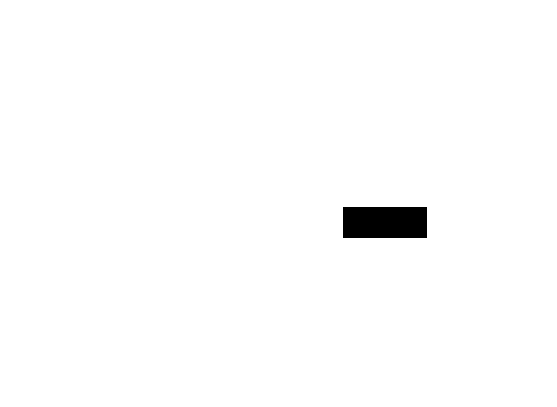
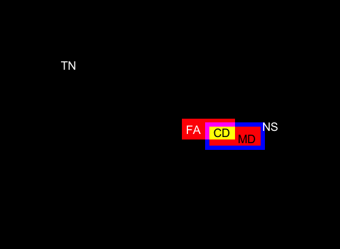

***

<!-- more -->

### Description

* Date: 06/04/2016
* Author: Yooyoung Lee

* This script calculates performance scores for localizing manipulated area 
  between reference mask and system output mask

* Disclaimer: this software was developed at the National Institute of Standards 
and Technology (NIST) by employees of the Federal Government in the
course of their official duties. Pursuant to Title 17 Section 105 
of the United States Code, this software is not subject to copyright 
protection and is in the public domain. NIST assumes no responsibility 
whatsoever for use by other parties of its source code or open source 
server, and makes no guarantees, expressed or implied, about its quality, 
reliability, or any other characteristic.

<!-- more -->

### Command-line Options

(Note that the long dash is a double dash)

Example:

% Rscript MaskScorer.r -i file -t manipulation -d /NC2016_Test0601 -r reference/manipulation/NC2016-manipulation-ref.csv 
-x indexes/NC2016-manipulation-index.csv -s /SystemOutputs/results.csv -m all -o myreport.csv 
--maskout y --maskpath dct_maskoutputs --bySet y --byPost y


The command-line options for detection scorer can be categorized as follows:


#### Input Type Options:

-i inType [file, DAPR]

  * Define file types to manage input files and output files.
    For example, “file” option will manually allow csv files as input/output,
    while “DAPR” will use arguments for querying the database.
    The DAPR type is work-in-progress at this point.

#### Task Type Options:

-t task [manipulation, removal, splice]

  * Define task types for evaluation

#### Reference data path option

-d ncDir

  * Define the data path (e.g., /NC2016_Test0601)

#### Input Options:

-r inRef

  * Define the reference csv file that contains the ground-truth information

-s inSys

  * Define the system output csv file that was formatted to NC2016 specification

-x inIndex

  * Define the index csv file for the detection task

#### Output Options:

-o out

  * Define the report output csv file (e.g., myreport.csv), this will automaticlly generate *_avg.csv file as well.


#### Kernel Size Options:

--eks 

  * Erosion kernel size (number must be odd; default = 15)

--dks

  * Dilation kernel size (number must be odd; default = 11)

#### Mask Outxput Options

--th

 * Define threshold value [0,1] for grayscale to convert to binary
 
--maskout [y, n] 

  * Define whether or not the error visulization mask (colored mask) output is saved 

--maskpath

  * Define the path name to save colored mask outputs

#### Metric Options:

-m metric [all, nmm, mcc, ham, wL1, hL1]

  * options
    +all: perform and show results for all metrics
    +nmm: NIMBLE mask metric
    +mcc: Matthews correlation coefficient
    +ham: Hamming distance
    +wL1: Weighted L1
    +hL1: Hinge loss L1
    
#### Report Options - Separated by Factors

--bySet [y, n]

  * Divide the reports by DatasetID (e.g., NIMBLE-Sci, NIMBLE-Web)

--byPost [y, n]
  
  * Divide the reports by PostProcessing (only available “Y” or “N” for now)
  
***

##### CSV Report for Each Mask File

```{r, echo=FALSE}

d1 <- read.csv("../../doc/results/mask_dct.csv", header = TRUE, row.names = NULL)
d2 <- d1[d1$NMM != -1,]
print(d2[1:10,24:30])
```


***

##### Average CSV Report by Factors 
```{r, echo=FALSE}

d3 <- read.csv("../../doc/results/mask_avg_dct.csv", header = TRUE, row.names = NULL)
print(d3)
```

***
##### Mask Output Marked in Color (one example from the DCT result)


***
***
#### Mask Scorer Procedure Visualization

<html>
<head>
<script type="text/javascript" src="http://latex.codecogs.com/latexit.js"></script>

</head>

 <body>
<table  border="3">
<tbody>
  <tr style="height:30.0pt"  height="200" >

  <td valign="middle" align="center"><a href="../../doc/maskImgs/rImg.png">
          </a> 
          <b>Reference Mask</b> <br>(3080 /226699 = 0.0136)</td>
  <td valign="middle" align="center"><a href="../../doc/maskImgs/sImg.png">
          </a>
          <b>System ouput mask</b> <br>(2958 / 226699 = 0.0130)</td>
  </tr>
  
  <tr style="height:30.0pt" height="220" >

  <td valign="middle" align="center"><a
          href="../../doc/maskImgs/dImg.png">
          </a> <b>Dilation</b> (KernSize: 11, Shape: Gaussian)<br>(4410 / 226699 = 0.0195)</td>
  <td valign="middle" align="center"><a
          href="../../doc/maskImgs/eImg.png">
          </a> <b>Erosion</b> (KernSize: 5, Shape: Gaussian) <br>(2604 / 226699 = 0.0115)</td>
  </tr>
  
  <tr style="height:30.0pt" height="220" >
  <td valign="middle" align="center"><a
          href="../../doc/maskImgs/wts.png">
          </a> <b>No Score Zone</b> : (Dilation - Erosion) <br> (4410 - 2604 = 1806) (1806 / 226699 = 0.0080)</td>
  <td valign="middle" align="center"><a
          href="../../doc/maskImgs/colormask.png">
          </a> <br> <b>Mask Scoring Example</b> <br></td>
  </tr>
  
  <tr style="height:30.0pt" height="100" >
  <td align="center"> <b>NIMBLE Mask Metric (NMM)</b>: -0.9316  <br>
  <p> \[max(-1, \frac{size(TP) - size(FN) - size(FP)}{size(GT)})\]</p>
  </td>
   
  <td align="center"> <b>False Positive area (FP)</b>: 1586<br><br>
  <b>False Negative area (FN)</b>: 1722 <br><br>
  <b>True Positive area (TP)</b>: 882 <br><br>
  <b>No Score zone (NS)</b>: 1806 <br><br>
  <b>Total area marked in color</b>: 5996
  </td>
  </tr>
  
</tbody>
</table>  
</body> 
</html>


